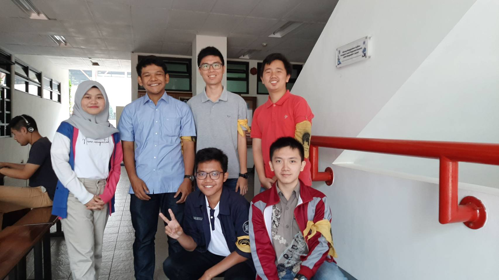

Pada hari Rabu, 21 Agustus 2019, kami mewawancarai seorang Daemon yang bernama Muhammad Fadhriga Bestari yang biasanya dipanggil ******** . Jurusannya adalah IF dan dia adalah Kepala Komisi Perbaikan Sistem dari DPP (Dewan Perwakilan & Pengawasan). Pada tahun sebelumnya, dia menjabat sebagai anggota suatu divisi di Arkavidia.
Kakak satu ini ingin memegang peran ini karena ingin melanjutkan AD/ ART dan melakukan amandemen pada AD/ART. Proker, ide atau jobdesc yang pernah dijalani di bidang Komisi Perbaikan Sistem adalah ngurusin pemilu dan nentuin ketua pemilu, membuat rancangan amandemen AD/ ART dan lain-lain.
Sebenarnya saat mau pemilihan magang apa di HMIF, dia awalnya mau memilih menjadi anggota Timsen, tetapi diajak untuk menjadi anggota DPP. Lama-kelamaan dia menjadi tertarik dengan hal-hal yang berhubungan dengan AD/ ART. Menurut dia, nilai-nilai yang terdapat di HMIF dan tidak ada di himpunan lain adalah momen bersenang-senangnya gitu. Saat mau memilih kuliah di ITB, dia memilih STEI karena melihat passing grade-nya yang paling tinggi. Ngomong-ngomong tentang unit, dia itu tidak mengikuti unit apapun alias GNU. Padahal pada awalnya, dia mendaftar di dua unit, yaitu *** dan Apres tetapi berhenti di tengah jalan.
Menurut dia, kebutuhan untuk mengubah atau mengamandemen AD/ ART masih menjadi wacana soalnya amandemen AD/ ART terakhir itu tahun 2013 atau 2014. Dia menginginkan bagian-bagian AD/ ART yang mau diubah itu hampir semua seperti makna tentang warna jahim, mukadimah dan alasan tentang jumlah-jumlah orang begituan dan lain-lain. Di saat wawancara, dia juga menginginkan tidak ada perbedaan antara Angmud (Anggota Muda) dan Angbis (Anggota Biasa) karena dirasa tidak ada lagi perbedaan yang signifikan antara keduanya. Menurut dia, SPARTA itu hanya seperti LKO (Latihan Kepemimpinan Organisasi), jadi setiap orang berhak untuk tidak ikut gitu. Akan tetapi, hal-hal ini masih mempunyai orang-orang yang melawan pernyataan ini.
Kami juga membicarakan tentang intern (magang). Kak Fadhriga cerita kalau kemaren dia magang di gojek.  Dia magang di Jakarta. Magangnya seru dan banyak manfaat yang didapat. Kak Fadhriga juga cerita kalau temannya saat magang kemarin ada yang mengundurkan diri dari proses magang tersebut, lalu melanjutkan untuk menjadi full time dan sekarang sedang pendidikan di India. Dia juga bilang kalau dosen banyak yang memberikan nilai lebih baik saat KP kalau mahasiswanya mengambil KP yang banyak ngoding.

  

woiiiii
